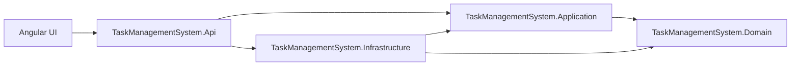
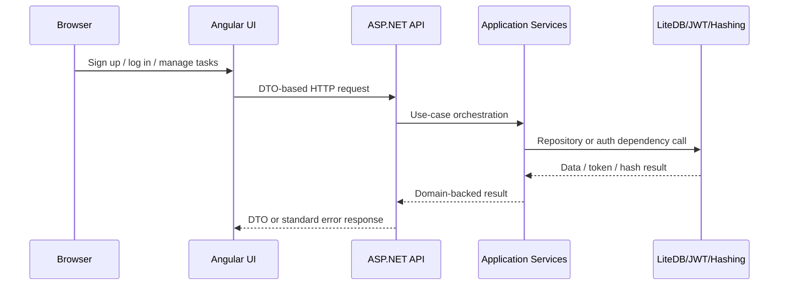

# Task Management System

Task Management System is a two-part solution:

- A .NET 10 Web API under [`api/`](./api) that manages users, authentication, and management tasks.
- An Angular 22 single-page application under [`ui/`](./ui) that provides public sign-up/login screens and a protected task workspace.

This documentation describes the repository as it exists today. Where the `specs/` folder describes broader or planned behavior that is not fully wired in code, that gap is called out explicitly.

## Project Overview

The backend follows a layered Clean Architecture design:

- `Domain` owns business entities and lifecycle rules.
- `Application` owns use-case orchestration, abstractions, and cache-aware services.
- `Infrastructure` owns LiteDB persistence, JWT generation, password hashing, and seed initialization.
- `Api` owns HTTP delivery concerns such as controllers, DTOs, validation, exception mapping, Swagger, and authentication configuration.

The frontend is a separate Angular application that consumes backend DTO contracts and uses standalone components, lazy-loaded routes, Angular Material, and NgRx.

## Technology Stack

### Backend

- .NET SDK `10.0.301`
- ASP.NET Core Web API
- FluentValidation
- JWT Bearer authentication
- Serilog console logging
- Swagger / Swashbuckle
- LiteDB
- xUnit, Moq, and FluentAssertions in unit tests

### Frontend

- Angular `22.0.1`
- Angular Material and CDK
- NgRx Store, Effects, Entity, and Router Store
- RxJS
- Karma + Jasmine
- TypeScript `6.0.3`

## Architecture Overview





## Repository Structure

### Top-Level Folders

| Path | Purpose |
| --- | --- |
| `api/` | Backend solution, projects, and unit tests. |
| `openapi/` | Repository-level OpenAPI snapshot. |
| `specs/` | Feature specifications, plans, tasks, quickstarts, contracts, and requirement checklists. |
| `ui/` | Angular frontend workspace. |
| `.agents/` | Local agent skills and automation support. |
| `.prompts/` | Prompt assets used in repo workflows. |
| `.specify/` | Spec workflow support files. |

### Backend Folders

| Path | Purpose |
| --- | --- |
| `api/src/TaskManagementSystem.Domain` | Entities, enums, and domain exceptions. |
| `api/src/TaskManagementSystem.Application` | Service contracts, repository abstractions, models, dependency registration, and orchestration logic. |
| `api/src/TaskManagementSystem.Infrastructure` | LiteDB context, repository implementations, JWT services, password hashing, and seed data initialization. |
| `api/src/TaskManagementSystem.Api` | Controllers, DTO models, validation, exception handling, app configuration, and startup wiring. |
| `api/tests/TaskManagementSystem.Domain.UnitTests` | Domain behavior tests. |
| `api/tests/TaskManagementSystem.Application.UnitTests` | Application service and dependency registration tests. |
| `api/tests/TaskManagementSystem.Infrastructure.UnitTests` | LiteDB, repository, and infrastructure wiring tests. |
| `api/tests/TaskManagementSystem.Api.UnitTests` | Controller, validation, OpenAPI, exception handling, and API registration tests. |

### Frontend Folders

| Path | Purpose |
| --- | --- |
| `ui/src/app/core` | Guards, interceptors, providers, and app-wide services such as auth session and notifications. |
| `ui/src/app/features/auth` | Public login and sign-up routes, components, validators, services, and auth state. |
| `ui/src/app/features/tasks` | Protected tasks page, task components, validators, API services, and tasks state. |
| `ui/src/app/shared` | Reusable models, utilities, and shared components such as feedback and page-state views. |
| `ui/src/app/styles` | Theme tokens and shared style definitions. |
| `ui/src/environments` | Frontend environment settings. |

### Spec Folders

| Path | Purpose |
| --- | --- |
| `specs/001-project-scaffolding` | Initial layering and project structure specification. |
| `specs/002-domain-model` | Domain entity and validation specification. |
| `specs/003-application-layer` | Application services, abstractions, and caching specification. |
| `specs/004-infrastructure-layer` | LiteDB and repository specification. |
| `specs/005-api-project` | Core API controller, DTO, and exception-handling specification. |
| `specs/006-management-task-api-enhancements` | Task query, lifecycle, idempotency, and archive behavior specification. |
| `specs/007-management-user-auth` | User creation, login, and endpoint protection specification. |
| `specs/008-api-dto-logging` | DTO-only responses, string enums, and logging specification. |
| `specs/009-management-ui` | Angular UI specification. |
| `specs/010-seed-data` | Currently only contains checklist material; there is no full seed-data spec document yet. |

## Implemented Features

### Backend Features

- Public management-user endpoints:
  - `GET /management-users`
  - `POST /management-users`
  - `POST /management-users/login`
- Protected management-task endpoints:
  - `GET /management-tasks`
  - `GET /management-tasks/{id}`
  - `POST /management-tasks`
  - `PUT /management-tasks/{id}`
  - `PATCH /management-tasks/{id}`
  - `PATCH /management-tasks/{id}/status`
  - `DELETE /management-tasks/{id}` for archive behavior
  - `GET /management-tasks/overdue`
  - `GET /management-tasks/due-within`
  - `GET /management-tasks/summary`
- Task lifecycle rules enforced in the domain:
  - Default status is `Pending` on create when omitted.
  - Allowed status transitions are `Pending -> InProgress`, `Pending -> Completed`, and `InProgress -> Completed`.
  - Completed tasks cannot be modified.
  - Archived tasks cannot be modified.
  - Completed tasks cannot be archived.
- Idempotent create support in the application layer using the `Idempotency-Key` header.
- In-memory caching for task reads with cache invalidation after task mutations.
- Standardized error responses with `traceId`.
- FluentValidation for request DTO validation.
- JWT-based authentication for protected endpoints.
- LiteDB-backed persistence for users, tasks, and idempotency records.
- Automatic seed initialization on first startup.

### Frontend Features

- Public routes:
  - `/login`
  - `/sign-up`
- Protected route:
  - `/tasks`
- Session persistence in browser `localStorage`.
- Automatic `Authorization` header injection for authenticated requests.
- Automatic redirect to `/login` when the API returns `401 Unauthorized`.
- Sign-up workflow with client-side required field, email, and password length validation.
- Login workflow with client-side required field and email validation.
- Protected task workspace with:
  - initial load scoped to the authenticated user's `userId`
  - search
  - status filter
  - pagination
  - page size control
  - archived-data toggle
  - task creation
  - task editing through full update
  - status changes
  - archive action through the delete endpoint
- Consistent snackbar feedback for successful and failed mutations.
- Inline mapping of backend validation errors back to form controls.

## Implemented vs Not Implemented

The repository contains a few important differences between specification intent and current code:

- The Angular UI does **not** include a users screen, even though `specs/009-management-ui/spec.md` discusses a test-only users screen and the backend now exposes `GET /management-users`.
- The Angular UI does **not** currently surface these backend capabilities directly:
  - `PATCH /management-tasks/{id}` partial update
  - `GET /management-tasks/overdue`
  - `GET /management-tasks/due-within`
  - `GET /management-tasks/summary`
- The backend does **not** currently implement the older `GET /management-users/{id}` behavior described in `specs/007-management-user-auth/spec.md`; the implemented public read endpoint is `GET /management-users`.
- Task sorting is described in some specs and query models, but the current backend query implementation effectively orders filtered task results by due date. `sortBy` and `sortDirection` are not consumed by the backend query DTO today.

## Authentication and Security Overview

### Backend

- JWT Bearer authentication is configured in [`api/src/TaskManagementSystem.Api/ApiServiceCollectionExtensions.cs`](./api/src/TaskManagementSystem.Api/ApiServiceCollectionExtensions.cs).
- Issuer, audience, signing key, and token lifetime come from `appsettings.json`.
- All `ManagementTaskController` endpoints require authentication through `[Authorize]`.
- `ManagementUserController` endpoints are public through `[AllowAnonymous]`.
- Passwords are hashed in infrastructure before persistence.
- Swagger is configured with a bearer security definition.

### Frontend

- Auth session data is stored in browser `localStorage` by [`ui/src/app/core/services/session-storage.service.ts`](./ui/src/app/core/services/session-storage.service.ts).
- Route guards block access to `/tasks` when no valid session exists.
- The auth interceptor adds `Authorization: Bearer <token>` to outgoing API requests.
- The API error interceptor clears the local session and redirects to `/login` on `401`.

### Security Notes

- CORS currently allows only `http://localhost:4200` and `https://localhost:4200`.
- Swagger UI is enabled only in the ASP.NET Core Development environment.
- The signing key in `appsettings.json` is a development value and should not be used unchanged outside local development.

## Database and Seed Strategy

- Persistence uses LiteDB.
- The default connection string is:

```json
"LiteDb": {
  "ConnectionString": "Filename=task-management.db;Connection=shared"
}
```

- On first startup, the backend checks whether the database file exists. If not, it seeds users and tasks through `ManagementSeedDataInitializer`.
- The seed currently creates:
  - 3 management users
  - 41 management tasks
- Seed password for all seeded users: `1234567890`
- Seeded user emails:
  - `alicia.moreno@example.com`
  - `marcus.bennett@example.com`
  - `sofia.chen@example.com`

## Configuration Overview

### Backend Configuration

Main backend configuration lives in [`api/src/TaskManagementSystem.Api/appsettings.json`](./api/src/TaskManagementSystem.Api/appsettings.json):

- `Logging.LogLevel`: standard ASP.NET Core logging levels
- `LiteDb`: connection string and collection names
- `Authentication`: JWT issuer, audience, signing key, and access token lifetime
- `AllowedHosts`: standard ASP.NET Core host filtering

Startup configuration in [`api/src/TaskManagementSystem.Api/Program.cs`](./api/src/TaskManagementSystem.Api/Program.cs) also enables:

- Serilog console logging
- Development-only Swagger UI
- global exception handling
- CORS for the Angular dev server
- HTTPS redirection
- authentication and authorization middleware

### Frontend Configuration

Frontend environment configuration currently lives in [`ui/src/environments/environment.ts`](./ui/src/environments/environment.ts):

```ts
export const environment = {
  apiBaseUrl: 'https://localhost:7203'
};
```

This means the Angular app expects the API HTTPS profile to run on port `7203`.

## Testing Strategy

### Backend

The backend test suite is split by architecture layer:

- `TaskManagementSystem.Domain.UnitTests`
- `TaskManagementSystem.Application.UnitTests`
- `TaskManagementSystem.Infrastructure.UnitTests`
- `TaskManagementSystem.Api.UnitTests`

Coverage includes domain rules, repositories, dependency registration, DTO validation, controller behavior, OpenAPI expectations, and global exception handling.

### Frontend

The frontend currently includes unit tests for:

- app shell bootstrapping
- auth guard behavior
- auth API service
- auth reducer
- task reducer
- task query validators

Frontend tests run through Karma with Chrome Headless.

### Verified Commands

These commands were validated during this documentation update:

- `dotnet restore TaskManagementSystem.slnx`
- `dotnet test tests/TaskManagementSystem.Api.UnitTests/TaskManagementSystem.Api.UnitTests.csproj --no-restore`
- `npm run build`
- `npm test`

## Development Guidelines

- Keep architecture boundaries intact:
  - business rules belong in `Domain`
  - use-case orchestration belongs in `Application`
  - persistence and platform concerns belong in `Infrastructure`
  - HTTP concerns belong in `Api`
  - presentation/state concerns belong in `ui`
- Prefer DTO mappings over leaking domain objects across boundaries.
- Keep controllers and Angular components thin.
- Mirror backend validation in the UI for usability, but keep the backend as the source of truth.
- Update docs when setup, ports, persistence behavior, or supported features change.
- Implement only behavior that is defined in `specs/` and actually exists in the current agreed scope.

## Useful Commands

### Backend

```powershell
cd api
dotnet restore TaskManagementSystem.slnx
dotnet run --project src/TaskManagementSystem.Api
dotnet test tests/TaskManagementSystem.Api.UnitTests/TaskManagementSystem.Api.UnitTests.csproj --no-restore
```

### Frontend

```powershell
cd ui
npm install
npm start
npm run build
npm test
```

## Local URLs

- Swagger UI: `https://localhost:7203/swagger`
- API base URL: `https://localhost:7203`
- Angular UI: `http://localhost:4200`

## Related Documentation

- [QUICKSTART.md](./QUICKSTART.md)
- [USERCASES.md](./USERCASES.md)
- [AGENTS.md](./AGENTS.md)
- [specs/](./specs)
